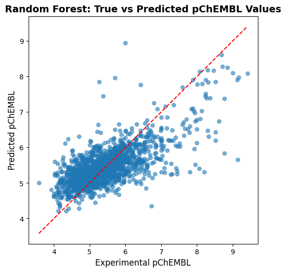
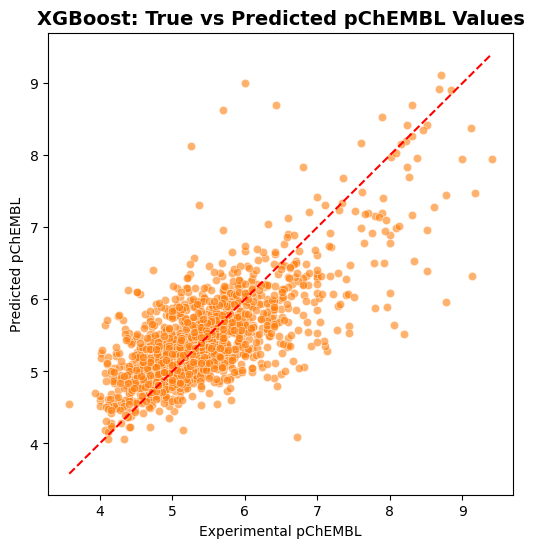
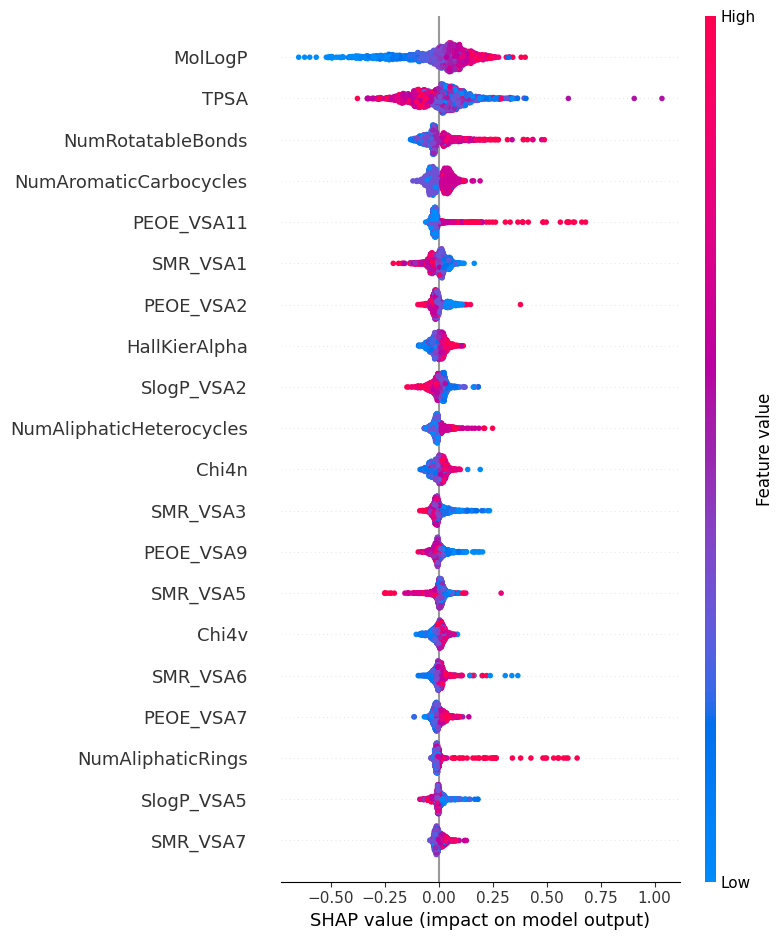
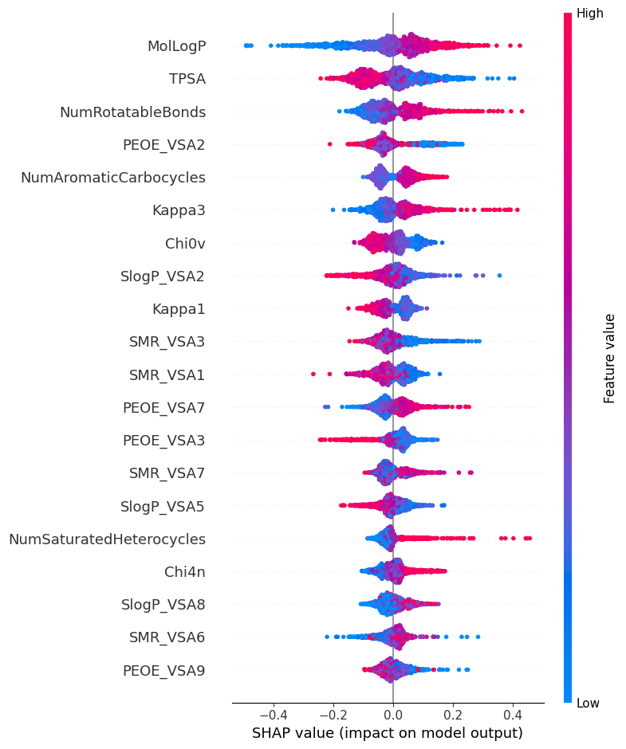

# Predicting hERG IC₅₀ with Machine Learning

[](https://colab.research.google.com/github/kandalkarankita/herg-ic50-prediction-ml/blob/main/notebooks/hERG_IC50_RF_XGBoost.ipynb)

**Author:** Ankita T. Kandalkar  
**Date:** September 2025  
**Environment:** Google Colab (Python 3.12)  

---

## Overview
This project applies machine learning to predict **hERG IC₅₀ values** (pChEMBL scale), a critical measure of **cardiotoxicity risk** in drug discovery.  
We evaluate **Random Forests, XGBoost, and ensemble models** on curated experimental data from **ChEMBL**.  
Results are interpreted using **SHAP analysis** to highlight key molecular features driving cardiotoxicity.

---

## Objectives
- Predict inhibitory concentration (IC₅₀) of compounds against the hERG ion channel.  
- Generate molecular descriptors using **RDKit**.  
- Train and compare **Random Forest** and **XGBoost** regression models.  
- Explore **ensemble strategies**: averaging, weighted averaging, stacking with cross-validation.  
- Evaluate performance with **R²** and **MAE**.  
- Apply **SHAP** to interpret molecular features influencing hERG inhibition.  

---

## Data
- Source: [ChEMBL](https://www.ebi.ac.uk/chembl/) (via AI Guide to Drug Discovery, 2024).  
- Initial dataset: **14,364 compounds**.  
- After cleaning & duplicate consolidation: **7,412 unique compounds** with pChEMBL values.  
- Features: **73 molecular descriptors** (physicochemical, topological, surface area).  

---

## Methodology
1. **Data Cleaning & Curation**  
   - Removed incomplete/missing entries.  
   - Consolidated duplicates by averaging pChEMBL values.  

2. **Feature Engineering**  
   - Generated 217 RDKit descriptors.  
   - Selected **73 interpretable features** (e.g., LogP, TPSA, rotatable bonds).  

3. **Model Training & Evaluation**  
   - Random Forest baseline.  
   - XGBoost gradient boosting.  
   - Ensemble strategies (average, weighted, stacking CV).  
   - Metrics: R² (variance explained), MAE (mean absolute error).  

4. **Interpretation**  
   - **SHAP values** reveal contribution of key descriptors.  
   - TPSA ↑ → hERG inhibition ↓.  
   - LogP ↑ → hERG inhibition ↑.  

---

## Results

### Model Comparison (R² and MAE)

| Model                   | R²    | MAE   |
|--------------------------|-------|-------|
| Random Forest            | 0.494 | 0.451 |
| XGBoost                  | 0.538 | 0.429 |
| Ensemble (Avg)           | 0.533 | 0.432 |
| Ensemble (Weighted 30/70)| 0.539 | 0.429 |
| Ensemble (Weighted 40/60)| 0.537 | 0.430 |
| Ensemble (Weighted 50/50)| 0.533 | 0.432 |
| Ensemble (Stacking, CV)  | 0.538 | 0.427 |

**Best accuracy**: Weighted ensemble (30/70, R² = 0.539).  
**Lowest error**: Stacking CV ensemble (MAE = 0.427).  

---

### Example Figures (to add in `/figures`)

- **Distribution of pChEMBL Values**  
    
  *Most compounds cluster around pChEMBL ≈ 5, with range 2.3–9.8.*  

- **Random Forest: True vs Predicted**  
    

- **XGBoost: True vs Predicted**  
    

- **SHAP Summary (Random Forest)**  
    
  *TPSA and LogP emerge as dominant features shaping cardiotoxicity predictions.*

  - **SHAP Summary (XGBoost)**  
    
  *Unlike Random Forest, XGBoost may capture more nuanced feature interactions, leading to a slightly different ranking or weighting of descriptors.*  

---

## How to Reproduce

### Open in Google Colab
Run the analysis interactively:  
[](https://colab.research.google.com/github/kandalkarankita/herg-ic50-prediction-ml/blob/main/notebooks/hERG_IC50_RF_XGBoost.ipynb)

### Or Run Locally
```bash
git clone https://github.com/kandalkarankita/herg-ic50-prediction-ml.git
cd herg-ic50-prediction-ml/notebooks
pip install -r requirements.txt
jupyter notebook herg_ic50_prediction.ipynb

