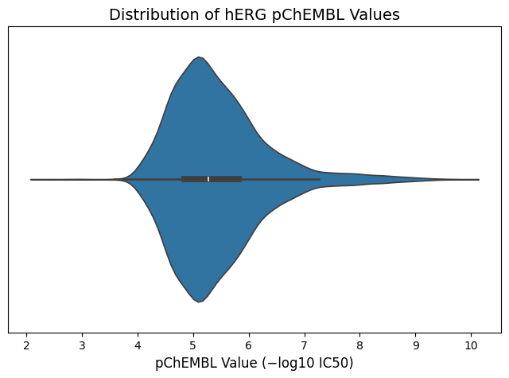

# Predicting hERG IC₅₀ with Machine Learning

[](https://colab.research.google.com/github/kandalkarankita/herg-ic50-xgboost-rf/blob/main/notebook/herg_prediction.ipynb)

**Author:** Ankita T. Kandalkar  
**Date:** September 2025  
**Environment:** Google Colab (Python 3.12)

---

## Overview

This project applies machine learning to predict hERG IC₅₀ values (pChEMBL scale), a critical measure of cardiotoxicity risk in drug discovery. We evaluate Random Forests, XGBoost, and ensemble models on curated experimental data from ChEMBL. Results are interpreted using SHAP analysis to highlight key molecular features driving cardiotoxicity.

---

## Why hERG Matters in Drug Discovery

The hERG (human Ether-à-go-go-Related Gene) potassium channel regulates cardiac repolarization. Blocking hERG causes QT interval prolongation, which can trigger fatal arrhythmias known as Torsades de Pointes. hERG liability is a leading cause of drug attrition in clinical development and has caused multiple FDA drug withdrawals, including terfenadine (Seldane), cisapride (Propulsid), and astemizole (Hismanal).

Approximately 60% of drug candidates fail due to safety concerns, with cardiotoxicity being a major contributor. Testing hERG liability experimentally is expensive and time-consuming (patch-clamp assays cost $500-1000 per compound). Computational prediction enables early-stage risk assessment, allowing medicinal chemists to deprioritize high-risk compounds and optimize chemical structures before synthesis.

---

## Objectives

- Predict inhibitory concentration (IC₅₀) of compounds against the hERG ion channel
- Generate molecular descriptors using RDKit
- Train and compare Random Forest and XGBoost regression models
- Explore ensemble strategies: averaging, weighted averaging, stacking with cross-validation
- Evaluate performance with R² and MAE
- Apply SHAP to interpret molecular features influencing hERG inhibition

---

## Data

**Source:** ChEMBL database  
**Initial dataset:** 14,364 compounds  
**After cleaning:** 7,412 unique compounds with pChEMBL values  
**Features:** 73 molecular descriptors (physicochemical, topological, surface area)

---

## Methodology

### 1. Data Cleaning & Curation
- Removed incomplete/missing entries
- Consolidated duplicates by averaging pChEMBL values

### 2. Feature Engineering
- Generated 217 RDKit descriptors
- Selected 73 interpretable features (e.g., LogP, TPSA, rotatable bonds)

### 3. Model Training & Evaluation
- Random Forest baseline
- XGBoost gradient boosting
- Ensemble strategies (average, weighted, stacking CV)
- Metrics: R² (variance explained), MAE (mean absolute error)

### 4. Interpretation
- SHAP values reveal contribution of key descriptors
- TPSA ↑ → hERG inhibition ↓
- LogP ↑ → hERG inhibition ↑

---

## Results

### Model Comparison (R² and MAE)

| Model | R² | MAE |
|-------|-----|-----|
| Random Forest | 0.494 | 0.451 |
| XGBoost | 0.538 | 0.429 |
| Ensemble (Avg) | 0.533 | 0.432 |
| Ensemble (Weighted 30/70) | **0.539** | 0.429 |
| Ensemble (Weighted 40/60) | 0.537 | 0.430 |
| Ensemble (Weighted 50/50) | 0.533 | 0.432 |
| Ensemble (Stacking, CV) | 0.538 | **0.427** |

**Best accuracy:** Weighted ensemble (30/70, R² = 0.539)  
**Lowest error:** Stacking CV ensemble (MAE = 0.427)

---

## Key Findings and Medicinal Chemistry Insights

This analysis identified **TPSA** (topological polar surface area) and **LogP** (lipophilicity) as primary molecular features driving hERG inhibition:

### TPSA (Polar Surface Area)

- **Finding:** Higher TPSA correlates with LOWER hERG inhibition (protective effect)
- **Mechanism:** The hERG channel binding site is predominantly hydrophobic. Polar compounds have reduced affinity for this lipophilic pocket.
- **Design guidance:** Incorporating polar functional groups (hydroxyl, amine, carboxyl) can reduce hERG liability while maintaining target activity.

### LogP (Lipophilicity)

- **Finding:** Higher LogP correlates with HIGHER hERG inhibition (risk factor)
- **Mechanism:** Lipophilic compounds partition into cell membranes and bind promiscuously to hydrophobic pockets, including hERG.
- **Design guidance:** Maintain LogP below 3-4 when possible. Reduce aromatic ring count and add polar substituents to lower lipophilicity.

### Other Identified Features

- **Molecular weight:** Larger molecules tend to have more hERG interactions
- **Hydrogen bond acceptors/donors:** Influence membrane permeability and binding
- **Aromatic rings:** Increase hydrophobic interactions with channel

These findings align with established medicinal chemistry design principles for avoiding hERG liability: minimize lipophilicity, increase polarity, avoid large flat aromatic systems.

---

## Model Performance and Practical Application

### Performance Summary

- **Best model:** Weighted ensemble (30% RF, 70% XGBoost)
- **R² = 0.539** (explains 54% of variance)
- **MAE = 0.429** (average error ~0.4 log units)

### Interpretation in Drug Discovery Context

This performance level is suitable for **early-stage virtual screening** and **risk flagging**, but not for definitive go/no-go decisions. The model should be used to:

1. **Prioritize compounds for synthesis:** Flag high-risk predictions (pChEMBL > 6, IC₅₀ < 1 μM) for structural modification
2. **Guide medicinal chemistry design:** Use SHAP insights to suggest structural changes (increase TPSA, reduce LogP)
3. **Complement experimental testing:** Predictions inform but do not replace patch-clamp assays

### Limitations

- R² = 0.54 means 46% of variance unexplained (other structural factors matter)
- Model trained on ChEMBL data may not generalize to all chemical scaffolds
- No external validation against independent datasets
- Binary classification (blocker vs non-blocker) might be more actionable than IC₅₀ regression

**Recommended workflow:** Use model for initial filtering (1000s of compounds down to 100s), then validate top hits experimentally.

---

## Figures

### Distribution of pChEMBL Values


Most compounds cluster around pChEMBL ≈ 5, with range 2.3–9.8.

### Model Predictions

**Random Forest:**


**XGBoost:**


### SHAP Feature Importance

**Random Forest:**


TPSA and LogP emerge as dominant features shaping cardiotoxicity predictions.

**XGBoost:**


Unlike Random Forest, XGBoost may capture more nuanced feature interactions, leading to a slightly different ranking or weighting of descriptors.

---

## Future Improvements

If extending this work, priorities would include:

1. **Molecular fingerprints:** Add ECFP4 or MACCS keys (often outperform descriptors alone)
2. **External validation:** Test on known marketed drugs or external benchmark datasets
3. **Deep learning:** Graph neural networks can capture complex structural patterns
4. **Uncertainty quantification:** Conformal prediction to flag unreliable predictions
5. **Structural alerts:** Incorporate known hERG-binding pharmacophores
6. **Multi-task learning:** Jointly predict hERG, CYP inhibition, and other ADMET properties

For a portfolio demonstration of cheminformatics fundamentals, the current implementation is appropriate and demonstrates core competencies in molecular descriptor calculation, ensemble machine learning, and interpretable feature analysis.

---

## How to Reproduce

### Open in Google Colab

Run the analysis interactively:

[](https://colab.research.google.com/github/kandalkarankita/herg-ic50-xgboost-rf/blob/main/notebook/herg_prediction.ipynb)

### Run Locally
```bash
git clone https://github.com/kandalkarankita/herg-ic50-xgboost-rf.git
cd herg-ic50-xgboost-rf/notebook
pip install -r requirements.txt
jupyter notebook herg_ic50_prediction.ipynb
```

---

## Technical Details

**Analysis Platform:** Python 3.12  
**Key Packages:** RDKit, Scikit-learn, XGBoost, SHAP, Pandas, Matplotlib  
**Data Source:** ChEMBL Database  
**Code:** Fully documented Jupyter notebook with step-by-step execution

---

## Author

**Ankita T. Kandalkar**  
Master's in Bioinformatics, Northeastern University  
Email: kandalkar.a@northeastern.edu  
LinkedIn: [linkedin.com/in/AnkitaTKandalkar](https://linkedin.com/in/ankitakandalkar)

---

## References

1. ChEMBL Database - [https://www.ebi.ac.uk/chembl/](https://www.ebi.ac.uk/chembl/)
2. RDKit Documentation - [https://www.rdkit.org/](https://www.rdkit.org/)
